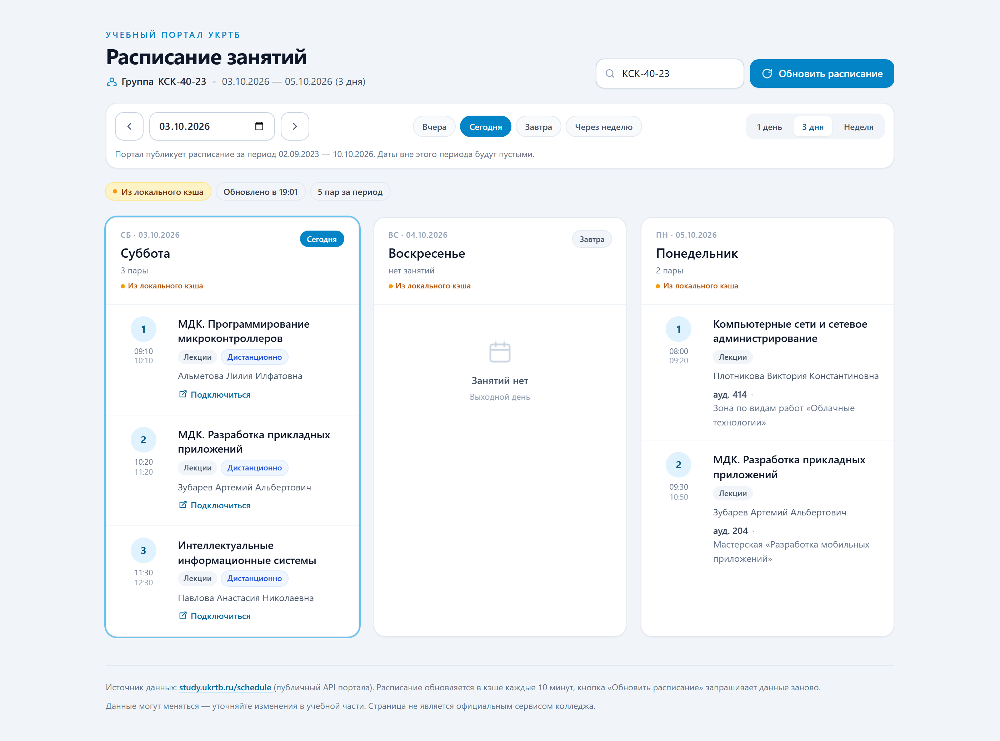
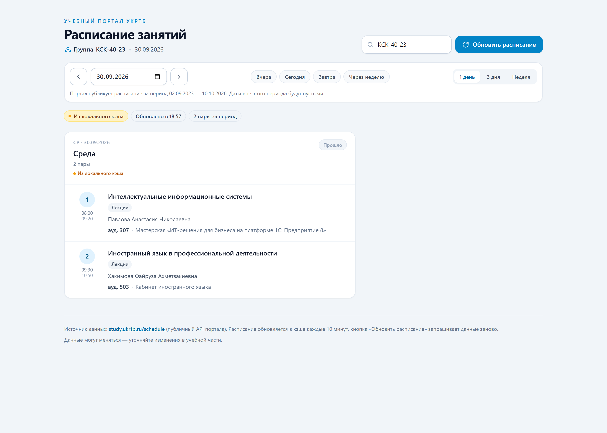
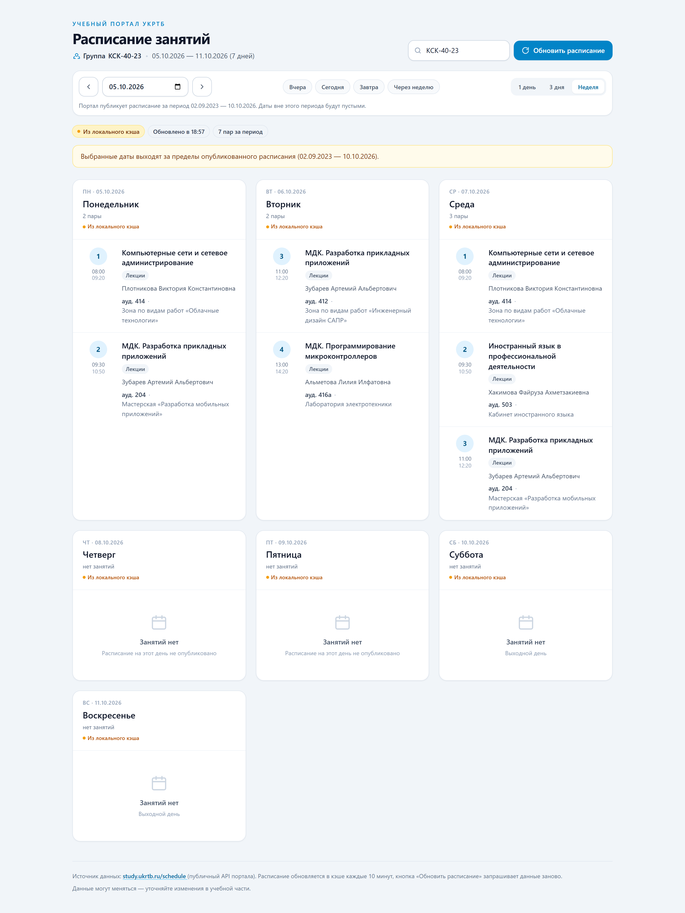
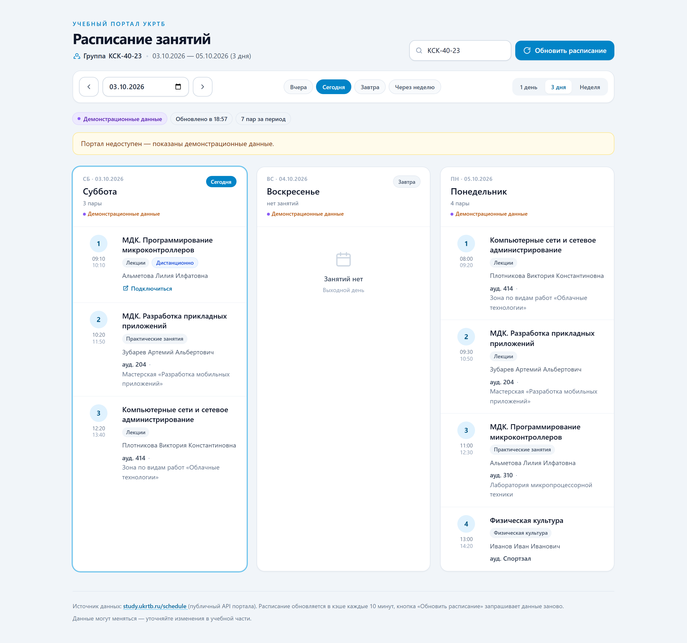

# Расписание группы КСК-40 — локальное веб-приложение

Локальный просмотр расписания группы **КСК-40** (Уфимский колледж радиоэлектроники,
телекоммуникаций и безопасности) на **любую дату**: сегодня, вчера, через неделю —
на 1, 3 или 7 дней вперёд от выбранного дня.

Данные берутся напрямую с учебного портала <https://study.ukrtb.ru/schedule>.



 

---

## Два режима работы

| | Локальное приложение | Публичная страница |
| --- | --- | --- |
| Адрес | <http://127.0.0.1:5000> | <https://vintubin17-stack.github.io/ukrtb-schedule/> |
| Запуск | `python app.py` | обновляется скриптом `refresh.ps1` |
| Данные | живые, запрос при каждом открытии | снимок расписания на 18 дней |
| Доступ | локально | публичный адрес |
| Смена группы | есть | нет (собирается под одну группу) |
| Кнопка «Обновить» | запрос к порталу | перечитывает файл данных |

### Почему публичная версия статическая

Портал `study.ukrtb.ru` открывается **не отовсюду**. Проверка доступности
из 17 стран мира:

| Откуда | Результат |
| --- | --- |
| США (us1, us5) | **200 OK за 0.6 с** |
| Германия, Нидерланды, Польша, Канада, Япония, Турция, Израиль, Иран, Молдова, Португалия, Сербия, Швейцария | `Connection timed out` |

Поэтому зарубежный хостинг живых данных не получит: развёрнутый на Render
(регион Франкфурт) экземпляр отвечает `source: "sample"` — демонстрационными
данными. Рабочее решение: расписание забирается на компьютере, где портал
доступен, и публикуется готовой страницей на GitHub Pages, которая раздаётся
по всему миру и не зависит от геоблокировки.

### Как обновляется публичная страница

```powershell
powershell -ExecutionPolicy Bypass -File refresh.ps1
```

Скрипт забирает 18 дней (7 назад и 10 вперёд), собирает каталог `docs/`
и отправляет его на GitHub; Pages обновляется сам в течение минуты.
В планировщике Windows уже создано задание **«Расписание УКРТБ (обновление)»**
— раз в 3 часа, когда компьютер включён. Коммит создаётся только при реальном
изменении расписания, а не ради отметки времени.

Выбор даты на публичной странице работает по всему собранному диапазону:
данные режутся на стороне браузера, сервер не нужен.

### Ярлык на домашнем экране телефона

Пошаговая инструкция для тех, кому лень читать этот файл, лежит на самом
сайте: **<https://vintubin17-stack.github.io/ukrtb-schedule/install.html>**
(и ссылка в подвале страницы).

Страница собрана как приложение: есть манифест, иконки и service worker.
После первого открытия она работает **без сети** — ярлык открывается
мгновенно и не показывает «Network lost», даже если связь пропала.

| Платформа | Как добавить |
| --- | --- |
| iPhone / iPad (Safari) | открыть адрес → **Поделиться** → **На экран «Домой»** |
| Android (Chrome) | **⋮** → **Добавить на главный экран** / **Установить приложение** |

⚠️ Если ярлык добавлялся раньше — **удалите его и добавьте заново**: старый
мог сохранить адрес сервиса на Render, который из Франкфурта не работает.

Иконки рисуются скриптом `make_icons.py` (нужен Pillow) — их можно
пересобрать в любой момент.

### Настоящее приложение для iPhone

В каталоге `ios/` лежит нативное приложение (SwiftUI + WKWebView): иконка,
полноэкранный режим, работа без сети, обновление жестом вниз, внешние ссылки
в Safari, **живая активность с текущей парой** на экране блокировки и в
Dynamic Island (название, ползунок, время окончания) и **напоминания о парах**
за 15 минут. Всё считается на устройстве, без сервера и push-уведомлений.
Нужен iOS 17. Масштабирование внутри приложения отключено — случайный
двойной тап при быстром нажатии больше не приближает страницу; в обычном
браузере зум остаётся, потому что он нужен для доступности.

**Mac не нужен** — сборка идёт на бесплатном macOS-раннере GitHub Actions.
Готовый `.ipa` публикуется в раздел
[Releases](https://github.com/vintubin17-stack/ukrtb-schedule/releases/tag/ios-latest).

| Способ установки | Стоимость | Кому подходит |
| --- | --- | --- |
| Сайт + «на экран Домой» | бесплатно | любой, по ссылке, за 10 секунд |
| **SideStore / AltStore / LiveContainer** | **бесплатно** | подпись бесплатным Apple ID; минус — продлевать раз в 7 дней |
| TestFlight | $99/год | до 10 000 человек по ссылке, продлевать не нужно |
| App Store | $99/год | все, но нужна проверка Apple |

Подробная инструкция по всем способам: [ios/README.md](ios/README.md).

---

## Быстрый старт

```bash
# 1. Перейти в каталог проекта
cd ukrtb-schedule

# 2. (рекомендуется) виртуальное окружение
python -m venv .venv
# Windows:
.venv\Scripts\activate
# Linux / macOS:
source .venv/bin/activate

# 3. Установить зависимости
pip install -r requirements.txt

# 4. Запустить приложение
python app.py
```

После запуска откройте в браузере: **<http://127.0.0.1:5000/>**

Полезные флаги:

```bash
python app.py --open            # сразу открыть браузер
python app.py --port 8000       # другой порт
python app.py --group КСК-40    # другая группа по умолчанию
python app.py --host 0.0.0.0    # доступ из локальной сети
python app.py --prod            # production-сервер waitress (для публикации)
python app.py --debug           # автоперезапуск при правке кода
```

Остановить сервер — `Ctrl+C` в терминале.

---

## Выбор даты

Над карточками расположена панель выбора даты:

| Элемент | Что делает |
| --- | --- |
| **‹ ›** | сдвигают окно на один день назад / вперёд |
| **Календарь** | выбор любой даты вручную (ограничен периодом портала) |
| **Вчера / Сегодня / Завтра / Через неделю** | быстрый переход на нужный день |
| **1 день / 3 дня / Неделя** | сколько дней показывать от выбранной даты |

| Прошедший день (1 день) | Неделя вперёд |
| --- | --- |
|  |  |

Текущее состояние хранится в адресной строке, поэтому ссылкой можно поделиться
или добавить её в закладки:

```
http://127.0.0.1:5000/?group=КСК-40&date=2026-09-30&days=1
```

Что стоит знать о датах:

* портал отдаёт расписание **и за прошедшие даты** — вчерашний день открывается
  как обычно (в шапке карточки будет пометка «Прошло», у сегодняшнего — «Сегодня»);
* у портала есть границы публикации (сейчас `02.09.2023 — 10.10.2026`). Они
  запрашиваются автоматически, показываются под панелью и ограничивают выбор
  в календаре;
* если на выбранные даты занятий нет, появляется пояснение — «возможно,
  расписание ещё не опубликовано» или «даты выходят за пределы опубликованного
  расписания». Это отличается от честного выходного, когда пар нет по расписанию.

---

## Тема: светлая, тёмная, автоматическая

Кнопка справа от «Обновить» переключает три режима по кругу:

| Режим | Поведение |
| --- | --- |
| **Авто** (по умолчанию) | тёмная с 20:00 до 07:00, светлая днём |
| Светлая | всегда светлая |
| Тёмная | всегда тёмная |

Выбор запоминается в браузере, а «авто» пересчитывается каждые 5 минут —
если оставить страницу открытой, в 20:00 она сама потемнеет. Цвет адресной
строки браузера тоже меняется.

**Как это сделано.** Разметка свёрстана утилитами `bg-slate-100`,
`text-slate-900` и подобными — переписывать их под тёмную тему было бы
сотнями правок. Вместо этого палитра Tailwind подменена CSS-переменными:
`tailwind.config` объявляет цвета как `rgb(var(--c-slate-100) / <alpha-value>)`,
а `static/theme.css` задаёт значения для светлой и тёмной темы. Переключение
темы — это один класс `dark` на `<html>`, и весь интерфейс перекрашивается.

Цвета не подобраны на глаз: `make_theme.py` скачивает Tailwind, берёт из него
точные значения светлой палитры и строит тёмную инверсией шкалы (фон 50 → 950,
текст 900 → 100). Насыщенные 500/600 не меняются — это кнопки и индикаторы,
они одинаково хороши в обеих темах.

```bash
python make_theme.py      # пересобрать static/theme.css
```

Приложение для iPhone открывает ту же страницу, поэтому тема работает и там:
выбранный режим сохраняется в браузере внутри приложения, а страница
дополнительно сообщает тему нативной части — чтобы строка состояния iOS
подстроила цвет текста.

---

## Как это работает

Портал `study.ukrtb.ru` — одностраничное приложение (React + Vite): в HTML-коде
расписания нет, оно подгружается через API. Поэтому **парсить HTML не нужно** —
используется тот же публичный JSON API, что и на сайте:

| Запрос | Назначение |
| --- | --- |
| `GET /api/schedules?date=YYYY-MM-DD&group=КСК-40-23` | расписание группы на дату |
| `GET /api/schedules/groups` | список всех учебных групп |
| `GET /api/schedules/timetables` | сетка звонков |
| `GET /api/frontend/schedule/get/border/date` | границы периода публикации |

Заголовок авторизации — `apikey`, значение публикуется самим колледжем в
<https://study.ukrtb.ru/postman_collection.json>. Ключ не является секретом, но
его можно переопределить (см. «Настройки»).

Поток данных:

```
браузер → Flask (/api/schedule) → schedule_client.py → study.ukrtb.ru/api
                                        ↓
                          кэш в памяти → кэш на диске → демо-данные
```

### Особенности реализации

* **Поиск группы по неполному названию.** В расписании группа называется
  `КСК-40-23`, поэтому запрос `КСК-40` сопоставляется с полным названием:
  точное совпадение → совпадение по началу строки → по вхождению подстроки.
  Если группа не найдена, интерфейс предложит похожие варианты.
* **Кэширование.** Свежий ответ API хранится 10 минут в памяти и на диске
  (`data/cache/`). Кнопка **«Обновить расписание»** игнорирует кэш и делает
  новый запрос к порталу.
* **Устойчивость к сбоям.** Если портал недоступен, показываются сохранённые
  данные с пометкой «Из локального кэша». Если кэша нет — демонстрационные
  данные из `data/sample_schedule.json` с пометкой «Демонстрационные данные».
  Интерфейс никогда не остаётся пустым.
* **Дистанционные пары.** В API есть флаг `do` (дистанционное обучение); такие
  пары помечаются бейджем «Дистанционно» и ссылкой «Подключиться».
* **Любая дата.** Расписание запрашивается на конкретный день, поэтому доступны
  и прошедшие даты (портал хранит их с 02.09.2023). Границы публикации
  запрашиваются у портала и кэшируются на 6 часов.
* **Ретраи.** Три попытки с нарастающей паузой, таймаут 15 секунд.

### Режимы работы

| Обычный режим | Портал недоступен |
| --- | --- |
|  |  |

На узких экранах карточки перестраиваются в одну колонку
([мобильный вид](docs/screenshot-mobile.png)).

---

## Структура проекта

```
ukrtb-schedule/
├── app.py                      # Flask-приложение: страница + API
├── wsgi.py                     # точка входа для waitress/gunicorn (публикация)
├── runner.py                   # запуск waitress с обработкой SIGTERM
├── build_static.py             # сборка статической версии в docs/ (GitHub Pages)
├── make_icons.py               # иконки для ярлыка на домашнем экране
├── make_theme.py               # палитра светлой и тёмной темы (theme.css)
├── refresh.ps1                 # обновить данные и опубликовать (запускает планировщик)
├── schedule_client.py          # клиент портала: запросы, парсинг, кэш (+ CLI)
├── requirements.txt            # зависимости Python
├── requirements-prod.txt       # + waitress для публикации
├── Dockerfile                  # образ для Docker-хостинга
├── render.yaml                 # конфигурация для Render (Blueprint)
├── fly.toml                    # конфигурация для Fly.io
├── publish.ps1                 # скрипт: создать репозиторий на GitHub и запушить
├── .dockerignore
├── README.md                   # этот файл
├── DEPLOY.md                   # пошаговая инструкция по выкладыванию в интернет
├── templates/
│   └── index.html              # разметка интерфейса (Tailwind CSS)
├── static/
│   ├── app.js                  # загрузка данных и отрисовка карточек дней
│   ├── styles.css              # анимации, скелетоны, печать, офлайн-фолбэк
│   ├── theme.css               # палитра светлой и тёмной темы (генерируется)
│   ├── install.html            # инструкция: как поставить на телефон
│   ├── sw.js                   # service worker: работа без сети
│   ├── manifest.webmanifest    # описание приложения для ярлыка
│   └── icons/                  # иконки (в том числе 1024×1024 для iOS)
├── ios/                        # нативное приложение (SwiftUI) и сборка в TestFlight
│   ├── App/                    # исходники приложения
│   ├── project.yml             # описание проекта для XcodeGen
│   └── README.md               # как собрать и выложить в TestFlight
├── .github/workflows/          # сборка iOS на macOS-раннере GitHub
├── tests/
│   └── test_schedule_client.py # самотесты: парсинг, даты, деградация при сбоях
├── docs/                       # публичная страница (GitHub Pages) + скриншоты
│   ├── index.html              #   собирается build_static.py
│   ├── data.json               #   расписание за 18 дней
│   ├── data.sig                #   отпечаток расписания (нужен refresh.ps1)
│   └── screenshot-*.png        #   скриншоты для этого README
└── data/
    ├── sample_schedule.json    # демо-данные на случай недоступности портала
    └── cache/                  # кэш ответов API (создаётся автоматически)
```

---

## Эндпоинты

| Метод | Адрес | Описание |
| --- | --- | --- |
| `GET` | `/` | веб-интерфейс |
| `GET` | `/api/schedule?group=КСК-40&date=2026-09-30&days=1&refresh=1` | расписание (JSON) |
| `GET` | `/api/groups?q=КСК` | список групп для автодополнения |
| `GET` | `/api/range` | период, за который портал публикует расписание |
| `GET` | `/api/health` | проверка работоспособности |

Параметры `/api/schedule`:

| Параметр | По умолчанию | Описание |
| --- | --- | --- |
| `group` | `КСК-40-23` | группа; можно указывать неполно (`КСК-40`) |
| `date` | сегодня | дата начала в формате `ГГГГ-ММ-ДД`; допускается прошлое |
| `days` | `3` | сколько дней вернуть, от 1 до 14 |
| `refresh` | — | `1` — запросить данные заново, минуя кэш |

Пример ответа `/api/schedule` (сокращён):

```json
{
  "ok": true,
  "group": "КСК-40-23",
  "source": "live",
  "generated_at": "2026-10-03T18:44:56",
  "days_count": 3,
  "start_date": "2026-09-30",
  "end_date": "2026-10-02",
  "start_label": "30.09.2026",
  "end_label": "02.10.2026",
  "has_lessons": true,
  "published_range": {
    "min": "2023-09-02", "min_label": "02.09.2023",
    "max": "2026-10-10", "max_label": "10.10.2026"
  },
  "warnings": [],
  "days": [
    {
      "date": "2026-09-30",
      "weekday": "Среда",
      "weekday_short": "Ср",
      "is_today": false,
      "is_tomorrow": false,
      "is_past": true,
      "has_lessons": true,
      "lessons_count": 2,
      "source": "live",
      "lessons": [
        {
          "number": 1,
          "discipline": "Интеллектуальные информационные системы",
          "type": "Лекции",
          "start": "08:00",
          "end": "09:20",
          "time": "08:00–09:20",
          "teacher": "Павлова Анастасия Николаевна",
          "teacher_short": "Павлова А. Н.",
          "teacher_link": null,
          "room": "307",
          "room_title": "Мастерская «ИТ-решения для бизнеса на платформе 1С: Предприятие 8»",
          "room_label": "307",
          "remote": false,
          "subgroup": 0
        }
      ]
    }
  ]
}
```

---

## Настройки (переменные окружения)

| Переменная | По умолчанию | Значение |
| --- | --- | --- |
| `UKRTB_GROUP` | `КСК-40-23` | группа по умолчанию |
| `UKRTB_BASE_URL` | `https://study.ukrtb.ru/api` | адрес API портала |
| `UKRTB_API_KEY` | публичный ключ портала | ключ доступа к API |
| `UKRTB_CACHE_TTL` | `600` | время жизни кэша расписания, сек |
| `UKRTB_RANGE_CACHE_TTL` | `21600` | кэш границ публикации, сек |
| `UKRTB_REFRESH_COOLDOWN` | `30` | пауза между принудительными обновлениями одной группы, сек (`0` — без ограничения) |
| `UKRTB_TIMEOUT` | `15` | таймаут запроса, сек |
| `UKRTB_CACHE_DIR` | `data/cache` | каталог кэша |
| `PORT` / `HOST` | `5000` / `127.0.0.1` | адрес локального сервера |

Пример:

```bash
# Linux / macOS
UKRTB_GROUP=КСК-30-24 UKRTB_CACHE_TTL=60 python app.py

# Windows PowerShell
$env:UKRTB_GROUP="КСК-30-24"; python app.py
```

---

## Публикация в интернете (свой домен)

> Пошаговая инструкция «от нуля до работающего адреса» — в отдельном файле
> **[DEPLOY.md](DEPLOY.md)** (GitHub → Render/Railway/Fly.io → свой домен).
> Ниже — что уже готово в проекте и как это устроено.

Локальный запуск и публичный — разные вещи. Три правила:

1. **Сервер разработки Flask в интернет не выставляем.** `python app.py` без
   флагов — только для локальной работы. Для публикации есть `wsgi.py`
   (waitress/gunicorn) и Dockerfile.
2. **Нужен HTTPS.** Без него браузеры ругаются, а провайдеры режут трафик.
   Сертификат Let's Encrypt выдаётся бесплатно (certbot / Caddy / Cloudflare).
3. **Портал колледжа надо беречь.** Кэш и защита от лавины запросов уже
   встроены (см. ниже), но при публичном размещении поднимите
   `UKRTB_CACHE_TTL` до 900–1800 и `UKRTB_REFRESH_COOLDOWN` до 60.

### Что уже готово в проекте

| Файл | Назначение |
| --- | --- |
| `wsgi.py` | точка входа для waitress/gunicorn |
| `requirements-prod.txt` | зависимости для публикации (`waitress`) |
| `Dockerfile` | готовый образ: подходит для Render, Railway, Fly.io, VPS |
| `.dockerignore` | не тащит в образ кэш, тесты и скриншоты |

Нагрузку на портал держат под контролем три механизма:

* **кэш на диске** — свежий ответ живёт `UKRTB_CACHE_TTL` секунд, поэтому
  сотня посетителей читает одни и те же данные без обращений к порталу;
* **single-flight** — если десять человек одновременно откроют один и тот же
  день, в сеть уйдёт ровно один запрос, остальные дождутся его результата
  (проверяется тестом `test_single_flight_fetches_day_once`);
* **ограничение кнопки «Обновить»** — принудительное обновление одной группы
  не чаще `UKRTB_REFRESH_COOLDOWN` секунд, иначе кнопка стала бы способом
  устроить нагрузку на чужой сервер.

### Куда разместить

| Вариант | Стоимость | Плюсы | Минусы |
| --- | --- | --- | --- |
| **Docker-хостинг** (Render, Railway, Fly.io, Timeweb Cloud) | есть бесплатный тариф | деплой из GitHub, HTTPS и домен выдаются сами | бесплатные тарифы «засыпают», первый запрос после паузы медленный |
| **Свой VPS + nginx + certbot** | ~150–400 ₽/мес | полный контроль, свой домен | всё настраивается руками |
| **Домашний ПК + Cloudflare Tunnel** | бесплатно | сервер арендовать не нужно, HTTPS и домен есть | компьютер должен быть включён; нужен свой домен в Cloudflare |
| **PythonAnywhere** | бесплатно / $5 мес | очень просто для Flask | ⚠️ на бесплатном тарифе исходящие запросы только к «белому списку» сайтов — портал колледжа недоступен |
| **Статическая версия** (GitHub Pages / Netlify) | бесплатно | самый бережный вариант: портал опрашивается раз в час по расписанию | теряются кнопка «Обновить» и смена группы; нужен отдельный генератор HTML |

### Пример: Docker-хостинг

В репозитории уже есть всё нужное — на Render/Railway достаточно указать
«Docker» как тип окружения и порт `8000`.

Локальная проверка того же образа:

```bash
docker build -t ukrtb-schedule .
docker run -d --name ukrtb -p 8000:8000 \
  -e UKRTB_CACHE_TTL=900 \
  -e UKRTB_REFRESH_COOLDOWN=60 \
  -v ukrtb-cache:/app/data/cache \
  ukrtb-schedule
# откройте http://localhost:8000/
```

Том `ukrtb-cache` важен: без него кэш будет теряться при каждом перезапуске,
и портал станет опрашиваться заново.

### Пример: свой VPS (systemd + nginx)

```ini
# /etc/systemd/system/ukrtb.service
[Unit]
Description=Расписание УКРТБ
After=network.target

[Service]
User=www-data
WorkingDirectory=/opt/ukrtb-schedule
Environment=PORT=8000
Environment=UKRTB_CACHE_TTL=900
Environment=UKRTB_REFRESH_COOLDOWN=60
ExecStart=/opt/ukrtb-schedule/.venv/bin/python wsgi.py
Restart=always
KillSignal=SIGTERM
TimeoutStopSec=15

[Install]
WantedBy=multi-user.target
```

```nginx
# /etc/nginx/sites-available/ukrtb
server {
    listen 80;
    server_name schedule.example.ru;

    location / {
        proxy_pass http://127.0.0.1:8000;
        proxy_set_header Host $host;
        proxy_set_header X-Real-IP $remote_addr;
        proxy_set_header X-Forwarded-For $proxy_add_x_forwarded_for;
        proxy_set_header X-Forwarded-Proto $scheme;
    }
}
```

Дальше `systemctl enable --now ukrtb`, `certbot --nginx -d schedule.example.ru` —
и HTTPS готов.

### Об этике и правилах

* Расписание принадлежит колледжу, приложение лишь показывает его. Публичная
  страница — повод оставить видимую пометку, что это не официальный сервис
  (она уже есть в подвале страницы).
* Чем агрессивнее кэш, тем вежливее приложение к порталу. Если планируется
  много посетителей, статическая версия (см. таблицу) предпочтительнее:
  портал опрашивается один раз в час, а не по каждому открытию страницы.
* Публичный адрес стоит закрыть от индексации поисковиками, если не хотите
  лишнего внимания: добавьте в `app.py` маршрут `/robots.txt` с
  `User-agent: *` / `Disallow: /`.

---

## Проверка парсинга без веб-интерфейса

`schedule_client.py` умеет работать как самостоятельная утилита:

```bash
python schedule_client.py --group КСК-40 --days 3              # расписание в консоль
python schedule_client.py --group КСК-40 --date 2026-09-30     # конкретная дата
python schedule_client.py --group КСК-40 --date 2026-10-05 --days 7
python schedule_client.py --group КСК-40 --json                # сырой JSON
python schedule_client.py --list-groups                        # все группы портала
python schedule_client.py --published-range                    # период публикации
python schedule_client.py --group КСК-40 --refresh             # игнорировать кэш
```

Пример вывода:

```
$ python schedule_client.py --group КСК-40 --date 2026-09-30 --days 1

Группа: КСК-40-23   (источник: live)

=== Среда, 30.09.2026
    1.   08:00–09:20  Интеллектуальные информационные системы
        Лекции · Павлова А. Н. · ауд. 307
    2.   09:30–10:50  Иностранный язык в профессиональной деятельности
        Лекции · Хакимова Ф. А. · ауд. 503
```

---

## Самотесты

Проверяют разбор ответа API, выбор даты (прошлое, будущее, границы периода),
защиту портала от публичного трафика (single-flight, ограничение обновлений)
и поведение при сбоях (кэш, демо-данные, ошибка при полном отсутствии
данных). Запускаются без сети:

```bash
python tests/test_schedule_client.py
```

Ожидаемый результат — `Ran 30 tests ... OK`.

---

## Если что-то не работает

| Симптом | Причина и решение |
| --- | --- |
| «Сайт колледжа недоступен» | нет интернета или портал недоступен. Приложение покажет кэш или демо-данные; проверьте связь и нажмите «Повторить запрос». |
| «Группа не найдена» | группа называется иначе. Нажмите на подсказку в сообщении об ошибке или уточните название: `python schedule_client.py --list-groups`. |
| Пустой список занятий | на эту дату расписания нет (выходной или ещё не опубликовано) — это нормально, карточка дня так и подписана. Текст предупреждения подскажет, в чём именно дело. |
| «Локальный сервер не отвечает» | остановлен `app.py`. Запустите его снова. |
| Упрощённое оформление без стилей | недоступен CDN Tailwind. Интерфейс продолжит работать; для полностью локальной версии соберите Tailwind CLI в файл `static/tailwind.css` и подключите его в `templates/index.html`. |
| `ModuleNotFoundError: flask` | не установлены зависимости: `pip install -r requirements.txt`. |

---

## Ограничения

* Приложение рассчитано на небольшой трафик (учебная группа, друзья): Flask +
  waitress на одном процессе. Кэш и демо-данные делают его устойчивым, но
  высокие нагрузки он не держит — для них нужен статический вариант.
* На бесплатных тарифах хостингов приложение «засыпает»; после пробуждения
  первый запрос идёт на портал и занимает несколько секунд.
* Данные принадлежат учебному порталу УКРТБ и могут изменяться; кэш ускоряет
  работу, но добавляет задержку до 10 минут (кнопка «Обновить расписание»
  снимает это ограничение).
* Учебный проект не связан с администрацией колледжа.
